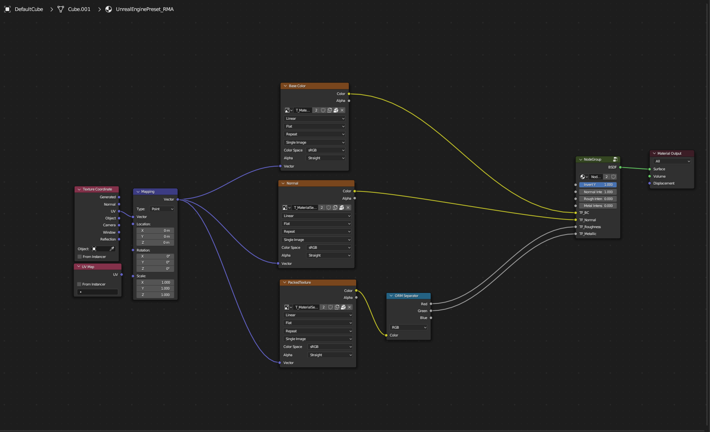
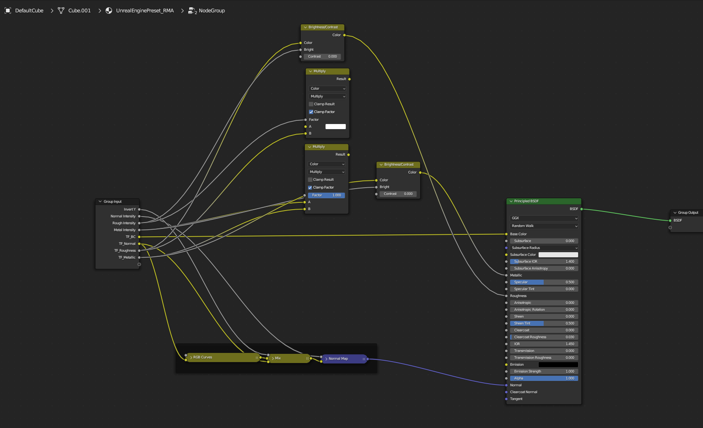

# Quick-Material-Setup
Create material by one click from base color texture.

Material controlls in N-panel

# Your own presets
You can change the default preset for your purposes. Do not change the image nodes.

All parameters from this group will be shown in the N-panel

